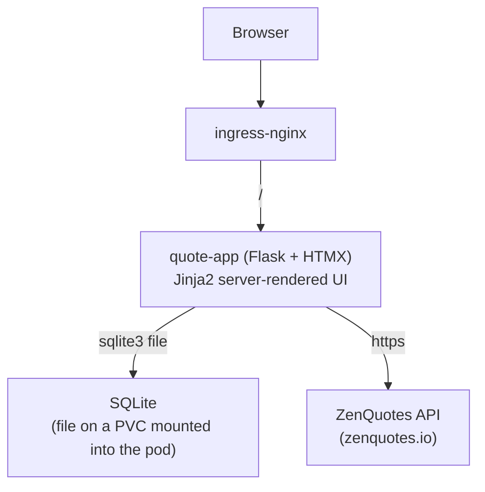

# Architecture

A reference for how `quote-k8s-python` is built: what the component does, its
data model, route surface, and auth flow. For setup/deploy instructions see
[`local-kind-setup.md`](local-kind-setup.md).

## Components

Unlike the Java original (separate `quote-api` + `quote-frontend` containers,
MongoDB backing store), this is **one container**: Flask renders full HTML
pages and HTMX partial fragments from the same process that owns the
database. There is no separate frontend build step, no JSON REST API
consumed by a JS client, and no `/api` vs `/` path split at the Ingress -
everything is one Service.

- **`app/`** - Flask app (application factory in `app/__init__.py`), organized
  into blueprints: `pages` (full HTML pages), `auth`, `quotes`, `favourites`,
  `viewed`, `admin`, `health`.
- **SQLite** - single file (`DATABASE_PATH`, default `/data/quotes.db` in the
  container) on a PVC. WAL mode + a busy timeout are enabled at connection
  time for headroom under light concurrent access. Only one pod replica is
  meaningful for a file-backed DB (see `k8s/deployment.yaml`,
  `strategy: Recreate`).
- **ZenQuotes** - public quote API (`app/services/zen_quotes.py`), used to
  backfill the quote pool when it runs low; failures degrade gracefully
  (returns `[]`, never raises) rather than breaking quote serving.
- **ingress-nginx** - routes all traffic to `quote-app-service`; not part of
  the application, installed once per cluster.

## Request flow

1. Browser loads a page (e.g. `/`) - Flask renders a full Jinja2 page
   (`templates/base.html` + a `pages/*.html` template).
2. Interactive elements (New Quote, Like, admin tables, ...) use
   [HTMX](https://htmx.org/) attributes (`hx-get`/`hx-post`/`hx-put`/
   `hx-delete`) to call dedicated fragment routes, which return HTML snippets
   (`templates/partials/*.html`) that HTMX swaps into the page - no full
   reload, no client-side JS framework, no JSON API.
3. Session auth uses a signed cookie (`session["username"]`); `before_request`
   loads the current user + roles from the DB on every request.

## Data model (SQLite tables, `app/models.py`)

| Table | Model | Purpose |
|---|---|---|
| `quotes` | `Quote` | `quote_id` (autoincrement), `quote_text`, `author`, `like_count`, `created_at`, `source` (`Local`/`ZenQuotes`). Backfilled from ZenQuotes on demand when running low. |
| `users` | `User` | `username` (primary key), `email`, `password_hash` (werkzeug `pbkdf2:sha256`), `is_active`. |
| `user_roles` | `UserRole` | `username` -> `role` (`ADMIN`/`USER`); a user can hold multiple role rows. |
| `user_likes` | `UserLike` | Per-user liked quotes with an `order` field for reordering favourites. |
| `user_progress` | `UserProgress` | Tracks `last_quote_id` per user, used to resume sequential browsing. |

## Route surface

Full-page routes (GET, always render `templates/base.html` + a page template;
`hx-boost` on `<body>` turns in-app navigation between them into swap-based
transitions without duplicating templates):

| Path | Auth | Purpose |
|---|---|---|
| `/` | - | Main quote view |
| `/login` | - | Login/Register form |
| `/profile` | login | Profile, change password, delete account |
| `/manage` | login | Management menu |
| `/manage/favourites` | login | My Favourites |
| `/manage/viewed` | login | My Viewed Quotes |
| `/manage/users` | ADMIN | User Management |
| `/manage/quotes` | ADMIN | Manage Quotes |
| `/healthz` | - | Liveness/readiness probe |

Fragment routes (only ever called via `hx-get`/`hx-post`/`hx-put`/`hx-delete`,
never linked to directly, so no route needs to branch on whether a request
came from HTMX):

| Method | Path | Auth | Purpose |
|---|---|---|---|
| POST | `/auth/register` | - | Register (default role USER) |
| POST | `/auth/login` | - | Login (username or email) |
| POST | `/auth/logout` | login | Logout |
| POST | `/auth/change-password` | login | Self-service password change |
| POST | `/auth/unregister` | login | Delete own account (password-verified, cascades) |
| POST | `/seed-users` | dev-flag gated | Seed `admin`/`user-1` demo accounts |
| POST | `/quote/new` | - | New quote (random+exclusions anon / sequential-next authed) |
| GET | `/quote/<id>` | login | Re-fetch by id for Previous/Next/First/Last (authed) |
| POST | `/quote/<id>/like` | login | Idempotent like |
| DELETE | `/quote/<id>/unlike` | login | Idempotent unlike |
| GET | `/favourites/strip` | login | Refresh the favourites quick-view strip |
| GET | `/favourites/table` | login | Refresh the favourites table |
| PUT | `/favourites/<id>/reorder` | login | Move up/down; swaps neighbor order |
| DELETE | `/favourites/<id>` | login | Unlike from Manage Favourites |
| POST | `/viewed/<id>/toggle-like` | login | Like/unlike toggle from Viewed Quotes |
| POST | `/viewed/delete-all` | login | Deletes all likes, resets progress to 0 |
| GET | `/admin/users/table` | ADMIN | Users table fragment |
| POST | `/admin/users/<username>/roles/<role>` | ADMIN | Grant role (idempotent) |
| DELETE | `/admin/users/<username>/roles/<role>` | ADMIN | Revoke role (blocked for own ADMIN) |
| DELETE | `/admin/users/<username>` | ADMIN | Delete another user, cascades (blocked for self) |
| GET | `/admin/quotes/table` | ADMIN | Paginated/sorted/searchable quotes table + stats |
| POST | `/admin/quotes/fetch-zen` | ADMIN | Force-fetch from ZenQuotes, dedup text+author |

## Auth flow

1. `POST /auth/login` verifies the password hash (`werkzeug.security`,
   `pbkdf2:sha256`) and, on success, stores `session["username"]` in a signed
   cookie (`SESSION_COOKIE_HTTPONLY`, `SameSite=Lax`).
2. Every request's `before_request` hook (`app/__init__.py`) loads the
   current `User` row and their `UserRole` rows fresh from the DB into
   `g.user`/`g.roles` - roles are never cached in the cookie, so a role
   change takes effect on the user's very next request.
3. `@login_required`/`@roles_required("ADMIN")` decorators
   (`app/auth/decorators.py`) enforce access; an unauthenticated HTMX
   request gets an `HX-Redirect` response header instead of a normal 302
   (a partial-swap request can't follow a redirect the way a full navigation
   can).
4. The Flask `SECRET_KEY` used to sign session cookies is provided via a k8s
   Secret generated at deploy time (see `local-kind-setup.md`) - never
   committed to git.

## Anonymous vs. authenticated quote browsing

- **Anonymous**: `POST /quote/new` returns a random quote excluding any IDs
  the client has already seen this session; Previous/Next/First/Last are
  handled entirely client-side (`app/static/js/app.js`) against a small
  in-memory array of quotes seen so far - no server round trip.
- **Authenticated**: quotes are served sequentially from `user_progress`;
  New Quote/Next advance server-tracked progress, Previous/First/Last
  re-fetch by id within `[1, last_quote_id]` without advancing it.
- Either path triggers a ZenQuotes backfill (`app/quotes/service.py`) when
  the pool is running low (`max(quote_id) < 5`, the next needed id exceeds
  the max, or the exclusion set has exhausted the anonymous pool).

## Security considerations

- `POST /seed-users` is unauthenticated and creates hardcoded demo accounts.
  It's a dev/test convenience gated by `SEED_USERS_ENABLED` - disable it for
  anything production-facing.
- The Flask `SECRET_KEY` must be unique per environment and is rotated on
  every `setup-kind.sh` run in this local-dev setup (see
  `local-kind-setup.md`) - fine here, would need a stable secret elsewhere.
