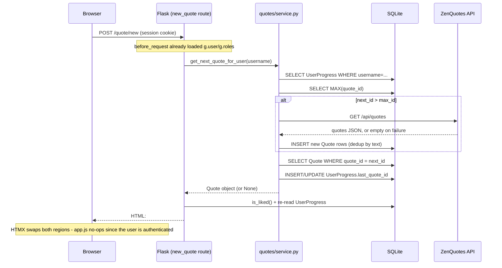

# What happens when a logged-in user clicks "New Quote"

*(Also available in Dutch: [`new-quote-flow.nl.md`](new-quote-flow.nl.md))*

A step-by-step trace of the request/response cycle for the **New Quote**
button in the sidebar (`app/templates/partials/quote_actions.html`), for the
**authenticated** case specifically. The anonymous-visitor case is
different (client-side history, random selection) and is only mentioned
here for contrast — see [`architecture.md`](architecture.md#anonymous-vs-authenticated-quote-browsing)
for that path.

## 1. The button and what it's wired to

```html
<button type="button" class="btn btn-new-quote" id="new-quote-btn"
        hx-post="/quote/new" hx-target="#quote-display" hx-swap="outerHTML"
        hx-include="#excluded-ids">
    New Quote
</button>
```

(`app/templates/partials/quote_actions.html:9-13`)

- `hx-post="/quote/new"` — on click, HTMX fires `POST /quote/new` instead of
  a normal form submission or page navigation.
- `hx-include="#excluded-ids"` — a hidden input's value is included in the
  POST body under the key `excluded_ids`. For a logged-in user this field is
  present but **ignored server-side** (it only matters for anonymous random
  browsing); `app/static/js/app.js` never populates it for authenticated
  sessions (`syncAnonHistoryFromDom` bails out immediately when
  `data-authenticated="true"`, `app.js:72-74`).
- `hx-target="#quote-display" hx-swap="outerHTML"` — the *primary* response
  content replaces the `<div id="quote-display">` element wholesale. This is
  only half the picture (see step 5) — the button row updates too, via a
  separate mechanism.
- The browser's session cookie (set at login, `app/auth/routes.py`) is sent
  automatically with the request; no token handling happens in JS.

## 2. Server: routing and auth context

The request hits `POST /quote/new`, handled by `new_quote()` in
`app/quotes/routes.py:40-50`. Before that view function runs, Flask's
`before_request` hook (`app/__init__.py:59-76`) has already:

1. Read `session["username"]` from the signed cookie.
2. Loaded the matching `User` row into `g.user`.
3. Loaded that user's `UserRole` rows into `g.roles`.

The `/quote/new` route itself carries **no** `@login_required` decorator —
it deliberately serves both anonymous and authenticated visitors, branching
on whatever `before_request` populated:

```python
@quotes_bp.route("/new", methods=["POST"])
def new_quote():
    if g.get("user") is not None:
        quote = service.get_next_quote_for_user(g.user.username)
    else:
        excluded = _parse_excluded_ids()
        quote = service.get_random_quote(excluded)
    ...
```

(`app/quotes/routes.py:40-50`)

Since `g.user` is set, this call goes to
`service.get_next_quote_for_user(g.user.username)` —
`app/quotes/service.py:89-105`.

## 3. Business logic: `get_next_quote_for_user`

```python
def get_next_quote_for_user(username: str) -> Quote | None:
    progress = db.session.get(UserProgress, username)
    next_id = (progress.last_quote_id + 1) if progress else 1

    max_id = _max_quote_id()
    if next_id > max_id:
        _fetch_more_quotes_if_needed()
        max_id = _max_quote_id()

    quote = db.session.get(Quote, next_id)
    if quote is None:
        quote = _find_next_available_quote(next_id, max_id)
    if quote is None:
        return None

    _update_user_progress(username, quote.quote_id, progress)
    return quote
```

(`app/quotes/service.py:89-105`)

Step by step:

1. **Look up progress.** `UserProgress.last_quote_id` for this username is
   read (0/absent if the user has never viewed a quote). `next_id` is
   `last_quote_id + 1` — this is purely sequential, not random.
2. **Check if a backfill is needed.** Unlike the anonymous path (which also
   backfills when the pool is merely *thin*, `MIN_POOL_SIZE = 5`), the
   authenticated path only backfills when the *specific next id doesn't
   exist yet* (`next_id > max_id`, i.e. the user has caught up to the end
   of the known quote list).
3. **Backfill from ZenQuotes, if triggered** — see step 4.
4. **Fetch the quote row** at `next_id`. If a quote was deleted (a gap),
   `_find_next_available_quote` linearly scans upward from `next_id` to
   `max_id` for the next row that still exists
   (`app/quotes/service.py:73-78`).
5. **If nothing is found at all** (empty database and no backfill
   available), return `None` — handled as a 404 by the route (step 6).
6. **Record progress.** `_update_user_progress` (`app/quotes/service.py:81-86`)
   either inserts a new `UserProgress(username, last_quote_id=quote.quote_id)`
   row or updates the existing one's `last_quote_id`, then commits. This
   single write **is** the app's notion of "viewed" — there's no separate
   viewed-quotes table; `get_viewed_quotes_for_user` later just queries
   `Quote.quote_id <= last_quote_id` (`app/quotes/service.py:112-121`).

### 4. The ZenQuotes backfill sub-flow (conditional)

Only runs when `next_id > max_id`. `_fetch_more_quotes_if_needed()`
(`app/quotes/service.py:19-41`):

1. Calls `zen_quotes.fetch_many()` (`app/services/zen_quotes.py:43-46`),
   which `GET`s `https://zenquotes.io/api/quotes` with a 5s timeout and up
   to 2 retries (0.5s apart). **On any failure — timeout, non-200, bad
   JSON — this returns `[]` rather than raising.** The caller treats an
   empty result as "added nothing" and moves on; it never surfaces an error
   to the user.
2. On success, loads every existing `quote_text` into a set for dedup, and
   inserts a new `Quote(quote_text=..., author=..., source="ZenQuotes")`
   for each fetched item whose text isn't already present.
3. Commits (a separate transaction from the progress update in step 3.6).

If ZenQuotes is unreachable and the local pool is genuinely exhausted, the
user ends up with `quote = None` and sees "No quotes available right now."
(`partials/quote_display.html:6`) rather than an error page.

## 5. Building the response

Back in the route, `_render_quote_card(quote)` (`app/quotes/routes.py:19-37`)
builds the HTML that gets sent back:

1. Re-checks whether the *returned* quote is already liked by this user
   (`service.is_liked`) — determines whether the Like button should render
   disabled.
2. Re-reads `UserProgress` (now updated) to get the fresh `last_quote_id` —
   determines whether Previous/Next/First/Last should be enabled.
3. Renders **two** template fragments and concatenates them into one HTTP
   response body:
   - `partials/quote_display.html` — the new quote text + author, wrapped
     in `<div id="quote-display">`. This is the *primary* content HTMX
     expects for the `outerHTML` swap into the element the button targeted.
   - `partials/quote_actions.html` with `oob=True` — the **entire button
     row** (New Quote, Like, Previous, Next, First, Last), re-rendered with
     fresh `hx-get`/`hx-post` URLs and `disabled` states for the new
     current quote, wrapped in `<div id="quote-actions" hx-swap-oob="true" ...>`.

The second part matters: the button row lives in the sidebar, physically
outside the `#quote-display` element the click targeted. Bundling it as an
**out-of-band (OOB) swap** in the same response lets one POST update two
separate regions of the page in one round trip — HTMX finds *any* element
in the response carrying `hx-swap-oob`, matches it by `id` against the
live DOM, and swaps it in-place, independent of the primary target.

## 6. What the browser does with the response

HTMX's response handling (triggered by the original click):

1. Replaces `<div id="quote-display">...</div>` (`outerHTML`) with the new
   one from the response — new quote text and author appear.
2. Separately swaps `<div id="quote-actions">...</div>` (also `outerHTML`,
   HTMX's default for OOB matches) with the freshly rendered button row —
   so **Like** re-enables/disables correctly for the new quote, **Previous**
   becomes enabled (since the user now has a quote before this one),
   **Next** stays disabled (this new quote *is* the frontier —
   `quote.quote_id >= last_quote_id` in `quote_actions.html:30`), and
   **First**/**Last** re-point their `hx-get` URLs at the new `last_quote_id`.
3. Fires an `htmx:afterSettle` event on `document.body`, which
   `app/static/js/app.js:100` listens for. Its handler
   (`syncAnonHistoryFromDom`) checks `#quote-actions`'s
   `data-authenticated` attribute, sees `"true"`, and returns immediately —
   **no further client-side JS logic runs for a logged-in user.** (That
   function's real job — building an in-memory quote history array — only
   matters for anonymous visitors; see `app.js:26-31`.)

No full page reload happens at any point. No JSON is exchanged — the
request body is form-encoded, the response body is HTML.

## 7. End state

- `UserProgress.last_quote_id` for this user is now one higher than before
  (or unchanged if the click resulted in a 404 with no quotes available).
- The visible quote card shows the new quote's text and author.
- The favourites strip below the quote card is **not** touched by this
  action — only liking/unliking a quote refreshes it (via the same OOB
  mechanism, in `app/quotes/routes.py:74-91`).
- If this was the user's first-ever click and the database started empty
  (or they'd already seen every stored quote), one or two ZenQuotes API
  calls happened transparently in the background as part of step 4, adding
  new rows to the `quotes` table that this and future requests can now
  serve.

## Sequence diagram


