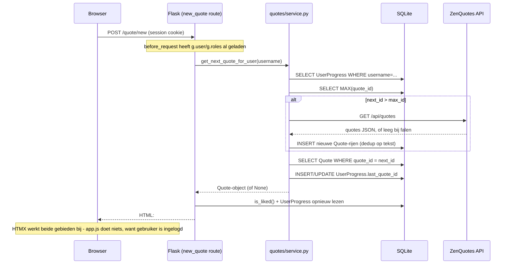

# Wat gebeurt er wanneer een ingelogde gebruiker op "New Quote" klikt

*(Nederlandse vertaling van [`new-quote-flow.md`](new-quote-flow.md))*

Een stap-voor-stap beschrijving van de request/response-cyclus voor de
**New Quote**-knop in de zijbalk (`app/templates/partials/quote_actions.html`),
specifiek voor het **ingelogde** geval. De flow voor een anonieme bezoeker
is anders (geschiedenis wordt client-side bijgehouden, willekeurige
selectie) en wordt hier alleen ter vergelijking genoemd — zie
[`architecture.md`](architecture.md#anonymous-vs-authenticated-quote-browsing)
voor dat pad.

## 1. De knop en waar die aan gekoppeld is

```html
<button type="button" class="btn btn-new-quote" id="new-quote-btn"
        hx-post="/quote/new" hx-target="#quote-display" hx-swap="outerHTML"
        hx-include="#excluded-ids">
    New Quote
</button>
```

(`app/templates/partials/quote_actions.html:9-13`)

- `hx-post="/quote/new"` — bij een klik stuurt HTMX een `POST /quote/new`,
  in plaats van een normale formulier-submit of paginanavigatie.
- `hx-include="#excluded-ids"` — de waarde van een verborgen input wordt
  meegestuurd in de POST-body onder de key `excluded_ids`. Voor een
  ingelogde gebruiker is dit veld wel aanwezig maar wordt het
  **server-side genegeerd** (het is alleen relevant bij anoniem/willekeurig
  browsen); `app/static/js/app.js` vult dit veld nooit voor
  geauthenticeerde sessies (`syncAnonHistoryFromDom` stopt meteen wanneer
  `data-authenticated="true"`, `app.js:72-74`).
- `hx-target="#quote-display" hx-swap="outerHTML"` — de *primaire*
  response-inhoud vervangt het hele `<div id="quote-display">`-element.
  Dit is maar de helft van het verhaal (zie stap 5) — de knoppenrij wordt
  ook bijgewerkt, via een apart mechanisme.
- Het session-cookie van de browser (gezet bij het inloggen,
  `app/auth/routes.py`) wordt automatisch meegestuurd met het verzoek; er
  vindt geen token-afhandeling plaats in JS.

## 2. Server: routing en auth-context

Het verzoek komt binnen op `POST /quote/new`, afgehandeld door
`new_quote()` in `app/quotes/routes.py:40-50`. Voordat die view-functie
draait, heeft Flask's `before_request`-hook
(`app/__init__.py:59-76`) al het volgende gedaan:

1. `session["username"]` uitgelezen uit het ondertekende cookie.
2. De bijbehorende `User`-rij geladen in `g.user`.
3. De `UserRole`-rijen van die gebruiker geladen in `g.roles`.

De route `/quote/new` zelf heeft **geen** `@login_required`-decorator —
hij bedient bewust zowel anonieme als ingelogde bezoekers, en vertakt op
basis van wat `before_request` heeft ingevuld:

```python
@quotes_bp.route("/new", methods=["POST"])
def new_quote():
    if g.get("user") is not None:
        quote = service.get_next_quote_for_user(g.user.username)
    else:
        excluded = _parse_excluded_ids()
        quote = service.get_random_quote(excluded)
    ...
```

(`app/quotes/routes.py:40-50`)

Omdat `g.user` gezet is, gaat deze aanroep naar
`service.get_next_quote_for_user(g.user.username)` —
`app/quotes/service.py:89-105`.

## 3. Business-logica: `get_next_quote_for_user`

```python
def get_next_quote_for_user(username: str) -> Quote | None:
    progress = db.session.get(UserProgress, username)
    next_id = (progress.last_quote_id + 1) if progress else 1

    max_id = _max_quote_id()
    if next_id > max_id:
        _fetch_more_quotes_if_needed()
        max_id = _max_quote_id()

    quote = db.session.get(Quote, next_id)
    if quote is None:
        quote = _find_next_available_quote(next_id, max_id)
    if quote is None:
        return None

    _update_user_progress(username, quote.quote_id, progress)
    return quote
```

(`app/quotes/service.py:89-105`)

Stap voor stap:

1. **Voortgang opzoeken.** `UserProgress.last_quote_id` voor deze
   gebruikersnaam wordt gelezen (0/afwezig als de gebruiker nog nooit een
   quote heeft bekeken). `next_id` is `last_quote_id + 1` — dit is puur
   sequentieel, niet willekeurig.
2. **Controleren of er aangevuld moet worden.** In tegenstelling tot het
   anonieme pad (dat ook aanvult zodra de voorraad simpelweg *dun* wordt,
   `MIN_POOL_SIZE = 5`), vult het ingelogde pad alleen aan wanneer *het
   specifieke volgende id nog niet bestaat* (`next_id > max_id`, d.w.z. de
   gebruiker heeft het einde van de bekende quote-lijst bereikt).
3. **Aanvullen vanuit ZenQuotes, indien getriggerd** — zie stap 4.
4. **De quote-rij ophalen** bij `next_id`. Als een quote verwijderd is (een
   gat in de reeks), scant `_find_next_available_quote` lineair vanaf
   `next_id` tot `max_id` naar de eerstvolgende rij die nog bestaat
   (`app/quotes/service.py:73-78`).
5. **Als er helemaal niets gevonden wordt** (lege database en geen
   aanvulling mogelijk), wordt `None` teruggegeven — dit wordt door de
   route afgehandeld als een 404 (stap 6).
6. **Voortgang vastleggen.** `_update_user_progress`
   (`app/quotes/service.py:81-86`) voegt ofwel een nieuwe
   `UserProgress(username, last_quote_id=quote.quote_id)`-rij toe, ofwel
   werkt de bestaande `last_quote_id` bij, en commit vervolgens. Deze ene
   schrijfactie **is** het begrip "bekeken" binnen de applicatie — er is
   geen aparte tabel voor bekeken quotes; `get_viewed_quotes_for_user`
   doet later gewoon een query op
   `Quote.quote_id <= last_quote_id` (`app/quotes/service.py:112-121`).

### 4. De ZenQuotes-aanvulflow (voorwaardelijk)

Draait alleen wanneer `next_id > max_id`. `_fetch_more_quotes_if_needed()`
(`app/quotes/service.py:19-41`):

1. Roept `zen_quotes.fetch_many()` aan (`app/services/zen_quotes.py:43-46`),
   die een `GET` doet naar `https://zenquotes.io/api/quotes` met een
   timeout van 5s en tot 2 retries (0,5s ertussen). **Bij elke soort
   falen — timeout, geen 200, ongeldige JSON — wordt `[]` teruggegeven in
   plaats van een exception.** De aanroeper behandelt een leeg resultaat
   als "niets toegevoegd" en gaat gewoon verder; er wordt nooit een fout
   getoond aan de gebruiker.
2. Bij succes worden alle bestaande `quote_text`-waarden in een set
   geladen om duplicaten te herkennen, en wordt voor elk opgehaald item
   waarvan de tekst nog niet bestaat een nieuwe
   `Quote(quote_text=..., author=..., source="ZenQuotes")` toegevoegd.
3. Commit (een aparte transactie t.o.v. de voortgangsupdate uit stap 3.6).

Als ZenQuotes onbereikbaar is en de lokale voorraad echt op is, eindigt de
gebruiker met `quote = None` en ziet die "No quotes available right now."
(`partials/quote_display.html:6`) in plaats van een foutpagina.

## 5. De response opbouwen

Terug in de route bouwt `_render_quote_card(quote)`
(`app/quotes/routes.py:19-37`) de HTML op die wordt teruggestuurd:

1. Controleert opnieuw of de *teruggegeven* quote al geliket is door deze
   gebruiker (`service.is_liked`) — bepaalt of de Like-knop uitgeschakeld
   moet worden weergegeven.
2. Leest `UserProgress` opnieuw (inmiddels bijgewerkt) om de actuele
   `last_quote_id` te krijgen — bepaalt of Previous/Next/First/Last
   ingeschakeld moeten zijn.
3. Rendert **twee** template-fragmenten en plakt ze aan elkaar tot één
   HTTP-responsebody:
   - `partials/quote_display.html` — de nieuwe quote-tekst + auteur,
     verpakt in `<div id="quote-display">`. Dit is de *primaire* inhoud
     die HTMX verwacht voor de `outerHTML`-swap in het element waar de
     knop op gericht was.
   - `partials/quote_actions.html` met `oob=True` — de **hele
     knoppenrij** (New Quote, Like, Previous, Next, First, Last), opnieuw
     gerenderd met verse `hx-get`/`hx-post`-URL's en `disabled`-status
     voor de nieuwe huidige quote, verpakt in
     `<div id="quote-actions" hx-swap-oob="true" ...>`.

Dit tweede deel is belangrijk: de knoppenrij staat in de zijbalk, fysiek
buiten het `#quote-display`-element waar de klik op gericht was. Door die
als **out-of-band (OOB) swap** mee te sturen in dezelfde response, kan één
POST twee losse delen van de pagina in één rondje bijwerken — HTMX zoekt
*elk* element in de response met `hx-swap-oob`, matcht het op `id` met de
live DOM, en vervangt het ter plekke, onafhankelijk van het primaire
doelelement.

## 6. Wat de browser doet met de response

De response-afhandeling van HTMX (getriggerd door de oorspronkelijke
klik):

1. Vervangt `<div id="quote-display">...</div>` (`outerHTML`) door de
   nieuwe uit de response — de nieuwe quote-tekst en auteur verschijnen.
2. Vervangt daarnaast, los daarvan, `<div id="quote-actions">...</div>`
   (ook `outerHTML`, de standaard van HTMX voor OOB-matches) door de
   vers gerenderde knoppenrij — zodat **Like** correct weer
   in-/uitgeschakeld wordt voor de nieuwe quote, **Previous** ingeschakeld
   raakt (de gebruiker heeft nu immers een quote vóór deze), **Next**
   uitgeschakeld blijft (deze nieuwe quote *is* de grens —
   `quote.quote_id >= last_quote_id` in `quote_actions.html:30`), en
   **First**/**Last** hun `hx-get`-URL's opnieuw richten op de nieuwe
   `last_quote_id`.
3. Vuurt een `htmx:afterSettle`-event af op `document.body`, waar
   `app/static/js/app.js:100` naar luistert. De handler
   (`syncAnonHistoryFromDom`) controleert het `data-authenticated`-attribuut
   van `#quote-actions`, ziet `"true"`, en stopt meteen —
   **er draait geen verdere client-side JS-logica voor een ingelogde
   gebruiker.** (De eigenlijke taak van die functie — het opbouwen van een
   in-memory geschiedenis van quotes — is alleen relevant voor anonieme
   bezoekers; zie `app.js:26-31`.)

Er vindt op geen enkel moment een volledige pagina-herlaad plaats. Er wordt
geen JSON uitgewisseld — de requestbody is form-encoded, de responsebody
is HTML.

## 7. Eindtoestand

- `UserProgress.last_quote_id` voor deze gebruiker is nu één hoger dan
  daarvoor (of ongewijzigd als de klik resulteerde in een 404 zonder
  beschikbare quotes).
- De zichtbare quote-kaart toont de tekst en auteur van de nieuwe quote.
- De favorietenstrook onder de quote-kaart wordt door deze actie **niet**
  aangeraakt — alleen het liken/unliken van een quote ververst die (via
  hetzelfde OOB-mechanisme, in `app/quotes/routes.py:74-91`).
- Als dit de allereerste klik van de gebruiker was en de database leeg
  begon (of de gebruiker had al elke opgeslagen quote gezien), zijn er als
  onderdeel van stap 4 transparant op de achtergrond één of twee
  ZenQuotes-API-aanroepen gedaan, die nieuwe rijen aan de `quotes`-tabel
  hebben toegevoegd die deze en toekomstige verzoeken nu kunnen bedienen.

## Sequentiediagram


